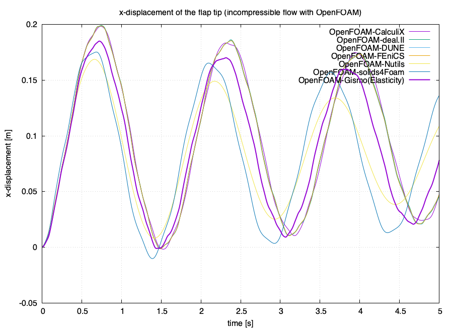
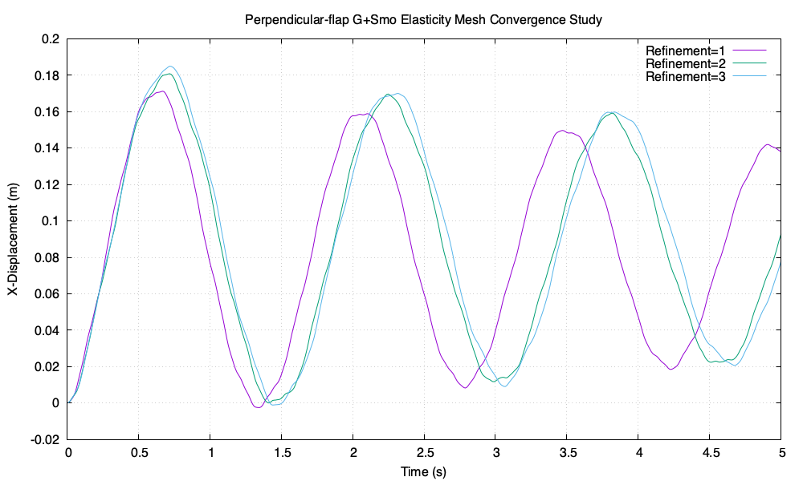

## Overview

This case builds upon the [partitioned heat conduction](https://precice.org/tutorials-partitioned-heat-conduction.html) tutorial with several key modifications: adding IGA-based structure solver G+Smo and exchanging stress data instead of force data.

## Requirements

To run the tutorial you need to install the following components:
- [preCICE](https://precice.org/quickstart.html)
- [G+Smo and gsPreCICE](https://github.com/gismo/gismo)

## Run the tutorial

### G+Smo and preCICE adapter (`gsPreCICE`) Installation
Since `gsPreCICE`is a submodule of G+Smo, you should download G+Smo first:

```
git clone https://github.com/gismo/gismo.git
```

Then, configure G+Smo with `-DGISMO_OPTIONAL=";gsPreCICE"`:

```
cd gismo
mkdir build
cd build
cmake .. -DGISMO_OPTIONAL="<other submodules>;gsPreCICE"
```

This will trigger a download of `gsPreCICE` from GitHub. Once `gsPreCICE` is downloaded, you can compile G+Smo with `gsPreCICE`:

```
make solid-gismo-elasticity -j<number of threads to use>
make install solid-gismo-elasticity 
```


### Runnning the G+Smo Tutorial 

Open two terminals and run:

```
cd solid-gismo-elasticity
./run.sh
```

and

```
cd fluid-openfoam
./run.sh
```

## Post-processing
The results of this tutorial are comparable to the simulation results communicated with force under the perpendicular-flap tutorials.


Additionally, the mesh convergence study data is available under the `images/data` directory. A sample plot illustrating the convergence of x-displacement over time is shown below:

